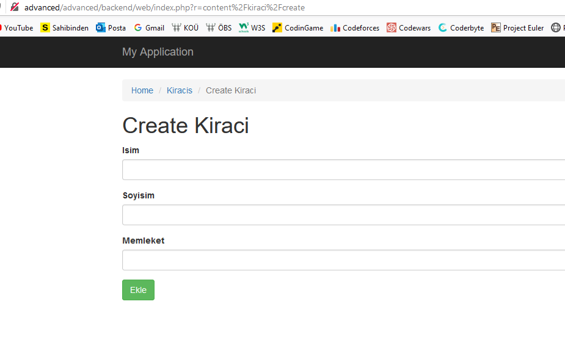

# Mahalle Emlak Nüfus Kontrol Modülü
 
## Hazırlayan :
170201081 - Abdulkadir Bir
### NOT ! : 
Projede teslim saatinden sonra değişiklik yapılmıştır. Son güncellenme tarihi 21.01.2021 22:50'dir.

## Özet
 Proje mahalleye yeni gelen insanların ikamet ettikleri konutlara göre emlak kontrolünü sağlamak amacıyla oluşturulmuş bir modüldür. Modülde kullanılan "Yii" frameworkunun sağlamış olduğu modüler yapıdan ve diğer imkanlardan faydalanılmıştır. Ayrıntılar "Ekran Görüntüleri" başlığı altında yer almaktadır
 
 Modülde iki yapı vardır:
1. Mahalleye yeni gelen insanları veritabanına ekler, veritabanından siler, o insan hakkındaki verileri günceller.
2. Birinci işlemde yer alan aynı fonksiyonları kiracı olarak gelen insanlar için de gerçekleştirir.

## Eksiklikler
Projede planlanan koşullarda ev sahibi olan insanların ve kiracı olan insanların listelendiği bir tablo da gösterilecekti. Diğer iki tablodan elde edilen verilerle tek bir tabloda tüm mahallede yaşayan insanların konut durumu gösterilecekti. Ayrıca mahallede toplamda kaç insan olduğu da tek tabloda böylece gösterilmiş olacaktı. Fakat bu işlemler yapılamadı.

Bir diğer eksik de veritabanında 3 tabloyu da birbiriyle ilişkilendirme yapabilmekti fakat yukarda belirtilen durumlardan dolayı sadece 2 tablo ilişkilendirildi. Detaylar aşağıda ekran görüntüleriyle gösterilecektir.

## Kurulum Aşamaları 
Modülü bilgisayarınıza kurmadan önce lütfen vagrant kurulumunu, sanal sunucu kurulumunu ve hepsinin ayarlarını başarılı bir şekilde yapınız. Vagrantla sunucunuzun ayağa kalkmış olması gerekmektedir. Ayrıca yii frameworkunu kullanarak `advanced` bir projenizi çalıştırmış olmalısınız. Bu `README.md` bölümünde "vagrant" ve "yii" ile ilgili kurulum aşaması yapılmayacaktır. Çünkü sadece modül anlatılacaktır, öncesinin hazır olduğu varsayılacaktır.

## Gerekli Paketler
Bu bölümde bilgisayarınızda kurulması gereken paketler belirtilmiştir.Lütfen açıklamalara dikkat ediniz :
- `ssh -i .vagrant\machines\sizinMakinenizinAdı\virtualbox\private_key vagrant@advanced` Bu komutu çalıştırmadan önce editörünüzde vagrantı ayağa kaldırmış olmanız gerekmektedir. Sonrasında ise vagrantın kurulu olduğu dizinde çalıştırılmalıdır.
- `cd /var/www/advanced/` Bu komut ile projenizin bulunduğu dizin açılacaktır.
- `composer require --prefer-dist abdulkadirbir/yii2-project "*" ` Bu komut Github'dan gerekli modülü indirecektir. Eğer hata alırsanız aşağıdaki komutu deneyiniz.
- `composer require --prefer-dist abdulkadirbir/yii2-project "dev-main"` Bu komuttan sonra modül projenize `../vendor` klasörü altında otomatik olarak inmiş bulunacaktır.

## Uygulamanın Çalıştırılması
Bu aşamaya kadar geldiyseniz başarılı bir şekilde modülü projenize eklemiş bulunmaktasınız. Bu aşamadan sonra bir kaç config ayarı yapılacaktır. Sırasıyla:
1. `../backend/config/main.php` dosyasına gidiniz.
2. `'modules' => [
        'content' => [
           'class' => 'abdulkadirbir\content\Module'
        ]
    ],` 
    Bu kodları `return` fonksiyonu altında bu şekilde düzeltiniz.  
 3. `php yii migrate` Bu komutu çalıştırmadan önce projede tanımlı olan veritabanıyla aynı isimde veritabanı oluşturduğunuzdan emin olun.
 4. `php yii migrate/up --migrationPath=@vendor/abdulkadirbir/yii2-content/src/migrations` Bu komutla beraber veritabanına ait işlemleri bitirmiş olacaksınız.
 5. Tebrikler. Artık web tarayıcınızdan `http://size/ait/alan/adi/backend/web/index.php?r=content/evsahibi/index` komutu ile mahalleye gelmiş olan ve ev sahibi olanları görüntüleyebilirsiniz. Ayrıca Yeni kişi ekleyebilirsiniz. Aynı işlemleri kiracılar üzerinden yapmak için de aşağıda ki komutu deneyebilirsiniz.
 
 `http://size/ait/alan/adi/backend/web/index.php?r=content/kiraci/index`

## Ekran Görüntüleriyle Birlikte Açıklamalar
1.Veritabanı tablolarının ilişkileri gösterilmiştir. Projenin eksik kısımları yukarıda anlatıldığı gibi üç tablo arasındaki ilişki gerçekleştirilmemiş olup sadece ikisi arasında vardır bu ilişki.

2.Mahallede kiracı olan insanların listelendiği sayfadır. Eğer yeni bir kiracı eklemek isterseniz `Mahalleye Kiracı Ekle` butonuna basmanız yeterli olacaktır. Eğer silmek isterseniz sağ tarafta bulunan çöp kutusu ikonu size yardımcı olacaktır.

3.Bu sayfada yeni bir kiracı ekleyebilirsiniz.

4. Mahallede ev sahibi olan insanların listelendiği sayfadır. Eğer yeni bir ev sahibi eklemek isterseniz `Mahalleye Ev Sahibi Ekle` butonuna basmanız yeterli olacaktır. Eğer silmek isterseniz sağ tarafta bulunan çöp kutusu ikonu size yardımcı olacaktır.

5.Bu sayfada yeni bir ev sahibi ekleyebilirsiniz.

6. Veritabanına başarılı bir şekilde ekleme yapıldığı aşağıdaki görselde gösterilmiştir.

# SONUÇ 
Uygulama Kocaeli Üniversitesi İnternet Programcılığı dersi için geliştirilmiştir. Proje düzgün bir şekilde çalışmakta olup planlanan projeye göre eksik kalan kısımlar yukarıdaki başlıklarda belirtilmiştir.
